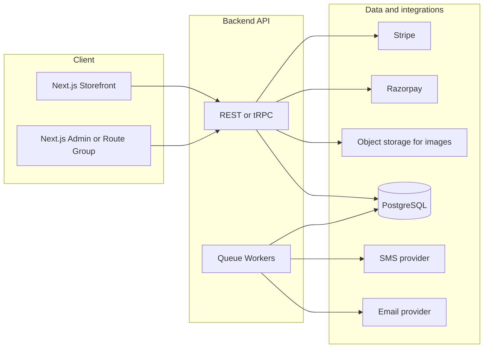

# Full-stack production structure for Ascension ecommerce

## Scope and source

- **Primary source:** [Ascension_Foundational_Requirements.md](c:\Users\USER\Desktop\Ascension\Ascension_Foundational_Requirements.md) (SRS v3.0 derivative): Next.js + Tailwind + Framer Motion; Node/Express **or** Java/Spring Boot; PostgreSQL preferred; NextAuth or Supabase Auth; Razorpay + Stripe; email/SMS; GST engine; PDF invoices; admin portal; security and performance NFRs.
- **Gap:** `Ascension.docx` was not located under `Ascension` or `Desktop`. If the Word SRS adds modules (e.g. returns, wishlists, coupons), map them into the same layers below.

## High-level architecture

**Recommendation:** Single **Next.js** app with **route groups** `(store)` and `(admin)` plus **middleware** for role checks, **or** split `apps/web` (store) and `apps/admin` if you want separate deployables. One **API** service (`apps/api` with Express/Fastify or `apps/api` with Spring Boot) owns checkout, tax, webhooks, and admin mutations; Next.js calls it from Server Actions / Route Handlers to keep secrets off the browser.

---

## Repository layout (monorepo)

Suits Turborepo or npm workspaces; names are illustrative.

| Path                 | Purpose                                                                                           |
| -------------------- | ------------------------------------------------------------------------------------------------- |
| `apps/web`           | Customer storefront (Next.js App Router)                                                          |
| `apps/admin`         | Optional separate admin Next app; *or* omit if using `apps/web/src/app/(admin)/...`               |
| `apps/api`           | REST API: catalog, cart sync, checkout, orders, webhooks, GST, invoice generation, admin CRUD     |
| `packages/ui`        | Shared React components (design tokens, buttons, form primitives)                                 |
| `packages/config`    | ESLint, TypeScript base, Tailwind preset (brand colors from §3)                                   |
| `packages/types`     | Shared DTOs / OpenAPI-generated types if applicable                                               |
| `packages/tax-india` | Pure functions: CGST/SGST/IGST from shipping state + HSN-ready line items (server-only)           |
| `infra/`             | IaC (Terraform/Bicep), Dockerfiles, CI workflows (referenced only—no file creation in this phase) |

---

## Storefront (`apps/web`) — routes and features

Align with §4; use App Router segments.

- `**/`** — Homepage: Framer Motion hero, staggered product grid, footer with Udyam + ™/® ([§3–4.1](c:\Users\USER\Desktop\Ascension\Ascension_Foundational_Requirements.md)).
- `**/products`** — Catalog: filters (category, size, color), sort price/newest ([§4.2](c:\Users\USER\Desktop\Ascension\Ascension_Foundational_Requirements.md)).
- `**/products/[slug]**` — PDP: gallery, zoom-on-hover, size guide, stock badge ([§4.3](c:\Users\USER\Desktop\Ascension\Ascension_Foundational_Requirements.md)).
- `**/cart`** — Cart page *and/or* shared `CartDrawer` component; subtotal, shipping, tax preview via API ([§4.4](c:\Users\USER\Desktop\Ascension\Ascension_Foundational_Requirements.md)).
- `**/auth/sign-in`**, `**/auth/sign-up*`* — Checkout gate ([§4.5](c:\Users\USER\Desktop\Ascension\Ascension_Foundational_Requirements.md)).
- `**/checkout`** — Multi-step: Shipping → Billing → Payment → Confirmation with stepper ([§4.5](c:\Users\USER\Desktop\Ascension\Ascension_Foundational_Requirements.md)).
- `**/account`** — Profile, password, addresses, order history + tracking ([§4.6](c:\Users\USER\Desktop\Ascension\Ascension_Foundational_Requirements.md)).
- `**/wishlist`** — Wishlist page with add/remove functionality.
- `**/about`** — Legal/trademark and business identifiers ([§7](c:\Users\USER\Desktop\Ascension\Ascension_Foundational_Requirements.md)).

**Suggested `src/` structure:** `app/`, `components/` (marketing, product, checkout, layout), `lib/` (api client, auth session helpers), `hooks/` (cart, media queries), `styles/` (globals + Tailwind). **No Three.js** ([§10](c:\Users\USER\Desktop\Ascension\Ascension_Foundational_Requirements.md)).

---

## Admin (`(admin)` or `apps/admin`)

Secured portal ([§5](c:\Users\USER\Desktop\Ascension\Ascension_Foundational_Requirements.md)):

- `**/admin/login`** — Staff-only (separate credential flow or same IdP with `role === admin`).
- `**/admin/products`** — CRUD, images upload to object storage, stock → auto out-of-stock at 0.
- `**/admin/orders`** — List/filter, fulfillment status, tracking number.
- `**/admin/marketing`** — Compose blast; enqueue jobs (email/SMS) to registered users with audit trail.

Use **RBAC** on every admin API route; never rely on UI hiding alone.

---

## Backend API (`apps/api`) — modules

Group by domain (folders or packages):

1. **Auth & users** — Register/login if not fully delegated to NextAuth/Supabase; password **bcrypt** ([§8](c:\Users\USER\Desktop\Ascension\Ascension_Foundational_Requirements.md)); session/JWT validation for BFF calls.
2. **Catalog** — Public product list/detail; filter/sort queries indexed in PostgreSQL.
3. **Cart** — Authenticated cart persistence; optional merge from `session_id` / guest token on login ([§8](c:\Users\USER\Desktop\Ascension\Ascension_Foundational_Requirements.md)).
4. **Checkout** — Validate inventory, compute shipping + **server-side GST** ([§7](c:\Users\USER\Desktop\Ascension\Ascension_Foundational_Requirements.md)), create `Order` + `OrderItem` in transaction, return payment client secret / Razorpay order id.
5. **Payments** — Stripe + Razorpay **webhook** handlers (idempotent); update `payment_status`; **no PAN/card storage**—tokens only ([§10](c:\Users\USER\Desktop\Ascension\Ascension_Foundational_Requirements.md)).
6. **Invoicing** — On successful payment, generate **PDF** (itemized, tax split, GSTIN, registered address) and store reference URL in DB or object storage ([§7](c:\Users\USER\Desktop\Ascension\Ascension_Foundational_Requirements.md)).
7. **Notifications** — Queue workers: order confirmation, shipping + tracking, password reset ([§6](c:\Users\USER\Desktop\Ascension\Ascension_Foundational_Requirements.md)).
8. **Admin** — Protected routes mirroring admin UI operations.

**Cross-cutting:** request validation (Zod/Jakarta validation), structured logging, correlation IDs, rate limits on auth/checkout/webhooks, HTTPS termination at edge.

---

## Data model extensions (beyond §9)

Base tables match [§9](c:\Users\USER\Desktop\Ascension\Ascension_Foundational_Requirements.md). For production and compliance, add minimally:

- `**ProductVariant`** (or JSONB on `Products`): `size`, `color`, `sku`, `stock_quantity`, `price_override` if variants differ.
- `**OrderTaxLine``: `order_id`, `tax_type` (CGST/SGST/IGST), `rate`, `amount`, `state_code` snapshot.
- `**Invoice``: `order_id`, `pdf_url`, `invoice_number`, `issued_at`, `gstin_snapshot`.
- `**PaymentIntent``: gateway, external_id, amount, currency, status (audit and webhook reconciliation).
- `**MarketingCampaign`` / `**NotificationLog**`: blast id, channel, template, sent_at, user_id (for admin marketing + compliance).
- `**Wishlist**`: `user_id`, `product_id`, `added_at`.
- `**AdminAuditLog**`: who changed inventory, order status, or sent campaigns.

Indexes: `products(category, created_at)`, `order_items(product_id)`, `orders(user_id, created_at)`, `cart_items(cart_id)`.

---

## Integrations (config-only surface)

| Concern                           | Placement                                                                                                                    |
| --------------------------------- | ---------------------------------------------------------------------------------------------------------------------------- |
| Razorpay / Stripe keys & webhooks | API env + signed webhook routes                                                                                              |
| SendGrid / Resend / SES           | Notification module + templates                                                                                              |
| Twilio / MSG91                    | SMS adapter behind single interface                                                                                          |
| Image CDN                         | Object storage + Next `Image` remote patterns ([§8](c:\Users\USER\Desktop\Ascension\Ascension_Foundational_Requirements.md)) |

---

## Production operations

- **Environments:** `dev` / `staging` / `prod`; secrets in vault or managed secrets; separate DB and webhook URLs per env.
- **CI:** lint, typecheck, tests, build; optional preview deploys for `web` + `api`.
- **Observability:** API metrics and error tracking; log payment webhook outcomes without PII.
- **Backups:** PostgreSQL PITR or daily snapshots; invoice PDF retention policy.

---

## NFR checklist (from §8)

- Lighthouse ≥ 85 mobile: image optimization, lazy load, font subsetting, limit motion cost on Framer Motion.
- Mobile-first responsive layout tokens in Tailwind.
- Guest cart: **localStorage** + sync API on login; logged-in cart in DB ([§8](c:\Users\USER\Desktop\Ascension\Ascension_Foundational_Requirements.md)).

---

## Optional stack tie-breaker

The markdown allows **Express or Spring Boot**. For fastest alignment with Next.js and shared TypeScript types, prefer **Node (Express or Fastify)** unless the team standardizes on Java; the **folder structure above is unchanged**—only `apps/api` implementation language differs.

---

## Next step if you add `Ascension.docx`

Place the docx in the repo (or paste extra sections) and diff against this structure: any SRS-only features (returns, analytics, multi-currency, etc.) map to new `app/` routes, API modules, and tables using the same layering.